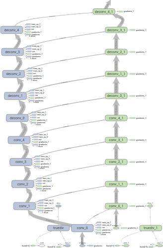

Multi-GPU models
################

Training deep learning models often requires large amounts of data and computation resources,
rendering the process quite time-expensive.
Models are trained for hours and/or days, which makes experimenting with different configurations cumbersome and slow.

.. figure:: _static/multi-gpu-speed.png
   :scale: 80%
   :align: right

   Performance gain with multiple GPUs in **cxflow-tensorflow** framework.

One way to speed up the process is utilizing multiple GPUs for model training. This may significantly lower the
required time, but the implementation is not always straightforward.
Luckily enough, we implemented the necessary routines to make arbitrary TensorFlow models
eligible for multi-GPU training.

Compatible models
-----------------
Chances are, your TensorFlow model is already ready for multi-GPU training in **cxflow-tensorflow**.
In fact, the only requirement is to use ``tf.get_variable`` instead of ``tf.Variable``, so that variables can be
reused and shared over multiple GPUs.

Multi-GPU training
------------------
To train on (multiple) GPUs, define the ``n_gpus`` parameter in the configuration file. E.g.:

.. code-block:: yaml
   :caption: config.yaml
   :emphasize-lines: 3

   model:
      class: nets.MyMultiGPUNet
      n_gpus: 4
      ...

That's it! Now run the **cxflow** training and check if all your GPUs are in fact utilized.

.. tip::
   Full example may be found in our
   `cxflow examples repository @GitHub <https://github.com/Cognexa/cxflow-examples/tree/master/mnist_convnet>`_.

.. tip::
   Increase your dataset **batch size** together with the ``n_gpus`` parameter.
   Each batch is distributed evenly between the GPUs alowing for much greater batch sizes!

Implementation details
----------------------

   Tower architecture for multi GPU training.

In order to leverage the true potential of multiple GPUs, **cxflow-tensorflow** creates a bit more complicated
computational graph than usual.
In fact, the whole model is multiplicated so that each GPU has its own *tower*.
The variables to be trained are, naturally, shared between the *towers*. Each GPU computes its own feed-forward
pass and the respective variable gradients.
Consequently, the gradients are averaged and used for update.

During the training **cxflow-tensorflow** distributes each batch equally among the *towers*.
The fetched outputs are concatenated preserving their orders which ensures perfect abstraction
for the remaining **cxflow** components.
From the perspective of hooks and datasets, nothing has changed.
Additionally, **cxflow-tensorflow** handles incomplete batches automatically.

A model trained on multiple GPUs may be restored and used for inference with equal or less amount of GPUs or even
on CPU without any trouble.
